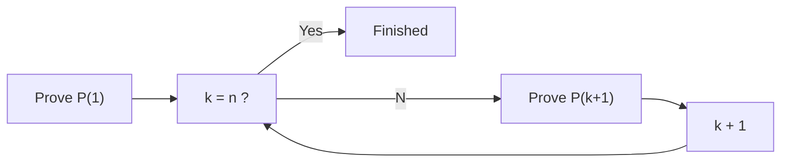

## Mathematical Induction
Step1: Prove that P(1) is true

Step2: Prove if (k) is true, then (k+1) is true

Step3: according Step1 and Step2， we can prove that P(n) is true for all positive integer n



### Example
**Prove:** $1+3+...+(2n-1) = n^2$

Step1: 
$$
P(1) = 1 = 1^2
$$

Step2: 
$$
P(n-1) = (n-1)^2 \\
P(n) = P(n-1) + (2n - 1) = (n - 1)^2 + (2n - 1) = n^2
$$

Step3:
$$
P(n) = n^2
$$

### Validation the Progarm
```rust
fn main() {
    let mut sum = 0;    // --> P(1)
    for i in 1..=100 {
        sum += i;       // --> P(k+1) = P(k) + k
    }
    println!("{}", sum);
}
```
mathmatical induction --> structural induction

## Three Important Point of a Recursive Function
1. A clear definition of the function
2. Implement the program logic of the boundary condition   // P(1)
3. If the return of the recursive function is true, implement the program logic of the recursive // P(k) -> P(k+1)

### Recursive Function for Factorial
```rust
fn facrorial(n: i32) -> i32 {
    if n == 1 {
        1
    } else {
        n * facrorial(n - 1)
    }
}
```


---
[TODO](https://oj.haizeix.com/problem/239) 